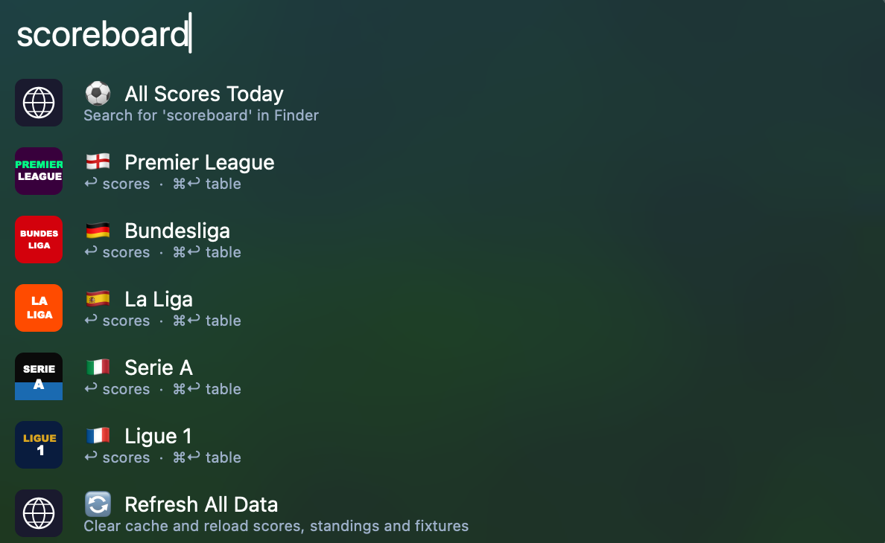
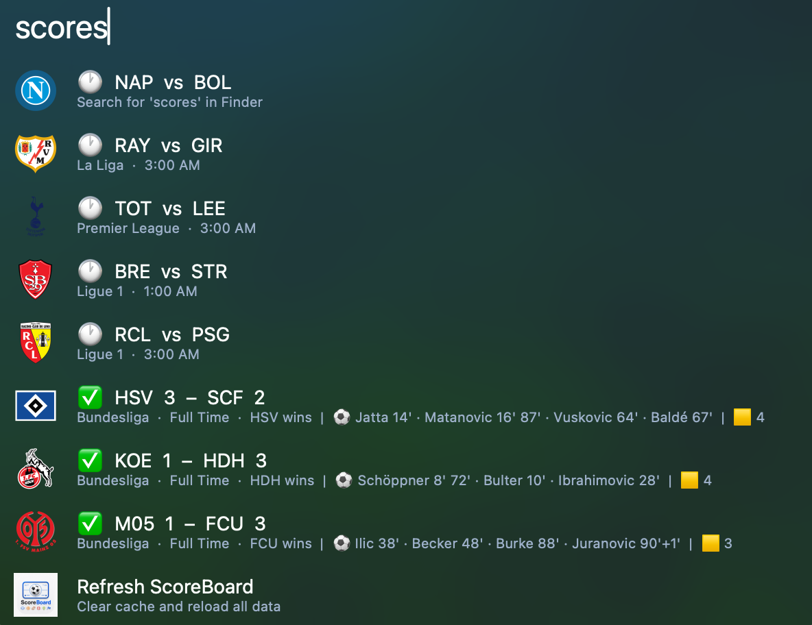
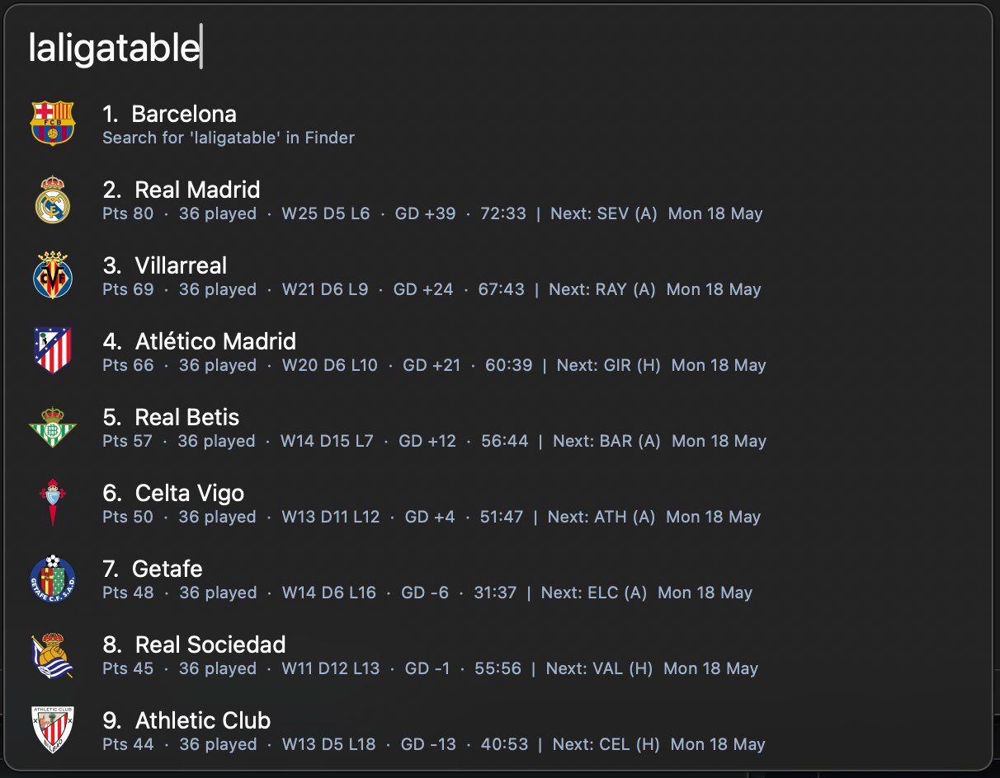
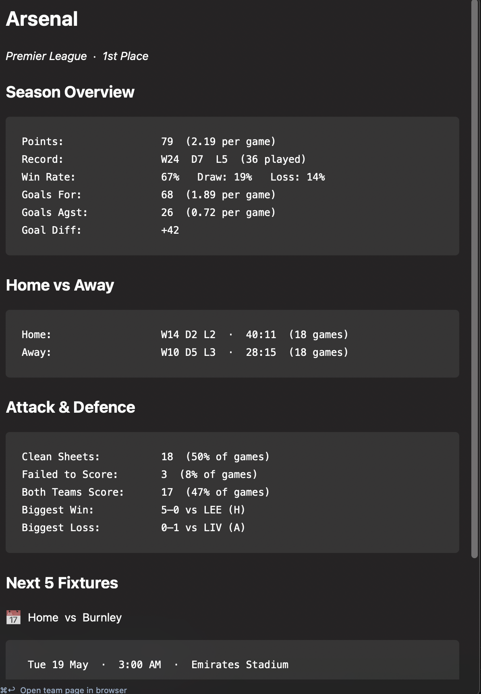

## Usage

Search live football scores across the top European leagues via the `scoreboard` keyword.

* <kbd>↩</kbd> View today's scores for that league.
* <kbd>⌘</kbd><kbd>↩</kbd> View the league standings table.

Alternatively, search scores directly via the `scores`, `epl`, `bundesliga`, `laliga`, `seriea`, or `ligue1` `ucl`, or `uel` keywords.

* <kbd>↩</kbd> Open the match on ESPN.

View standings via the `epltable`, `bundesligatable`, `laligatable`, `serieastable`, `ligue1table`, `ucltable`, or `ueltable` keywords.

* <kbd>↩</kbd> View full team stats — season overview, home/away splits, clean sheets, and next fixtures.
* <kbd>⌘</kbd><kbd>↩</kbd> Open the team page in the browser.

Clear the cache and force a fresh reload via the `scores:reload` keyword.

Configure the Hotkey to open the `scoreboard` launcher instantly from anywhere.

Set a favourite team and adjust the refresh interval in the Workflow's Configuration.
